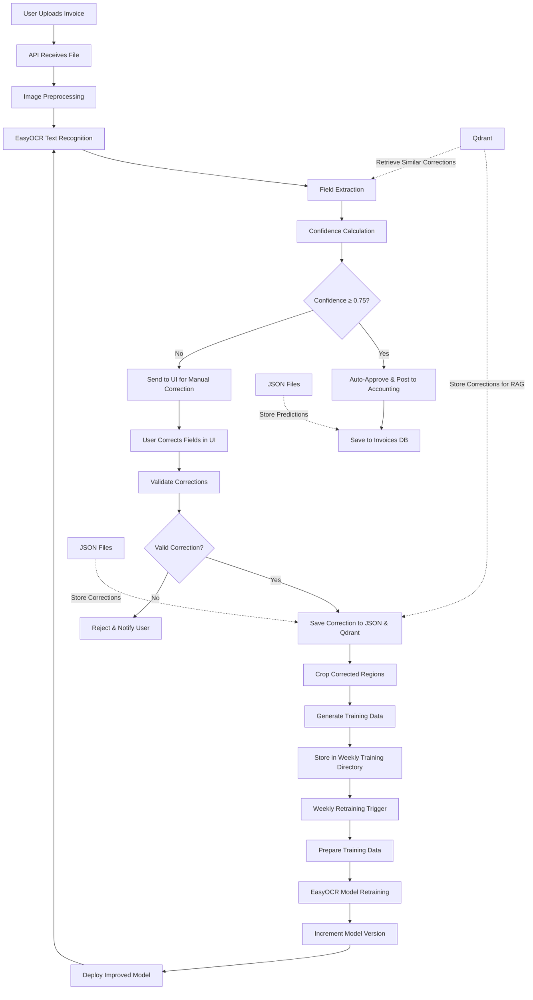

# Invoice Intelligence: Human-In-The-Loop OCR System

Production-ready invoice extraction system with human-in-the-loop learning that extracts 6 key fields from invoices (vendor, invoice no, date, tax, total, debit account) with confidence-based automation gating. The system uses EasyOCR for text recognition, applies confidence thresholds to determine automation vs. manual review, stores corrections in JSON files and Qdrant vector database for RAG (Retrieval-Augmented Generation), and continuously improves through weekly EasyOCR model retraining cycles. The application features a confidence-based gating system where invoices meeting the 0.75 confidence threshold are automatically processed while lower-confidence invoices are sent for manual correction via the UI. User corrections are stored and used to enhance future predictions through vector similarity matching and model retraining, with automatic model versioning after each improvement cycle.

## Components Overview

### Core Services
- **API Service**: FastAPI backend handling invoice uploads and processing
- **UI Service**: Gradio interface for manual corrections and feedback
- **OCR Engine**: EasyOCR for text recognition (replacing PP-OCRv4)
- **Field Extractor**: Rule-based and LLM-powered field extraction
- **Confidence Calculator**: Multi-factor confidence scoring system
- **Database**: SQLite for invoice storage, JSON files for predictions and corrections
- **Model Version Manager**: Tracks model versions and improvements

### Processing Pipeline
- **Image Preprocessing**: PDF to image conversion, noise reduction
- **Text Recognition**: OCR with EasyOCR engine
- **Field Extraction**: Regex patterns and LLM-based extraction
- **Confidence Scoring**: Multi-factor confidence calculation
- **Confidence Gating**: Threshold-based automation decision
- **Accounting Integration**: Journal entry creation and posting

### Learning Loop Pipeline
- **Correction Collection**: User feedback and corrections for all fields including debit/credit accounts
- **Vector DB Storage**: Corrections stored in Qdrant vector database with OCR text context for RAG
- **Correction Retrieval**: Similar past corrections of credit and debit accounts retrieved during processing for improved accuracy
- **Training Data Generation**: Cropped image regions from corrections for OCR text recognition model retraining
- **Model Retraining**: EasyOCR fine-tuning with corrected data and improved field extraction rules
- **Model Versioning**: Automatic version incrementing after each retraining cycle
- **Continuous Improvement**: Weekly retraining cycles with accumulated corrections

## Application Flow




## Tech Stack

| Component | Technology | Version |
|-----------|------------|---------|
| Package Manager | UV | 0.2.0+ |
| Backend | FastAPI + Uvicorn | 0.109+ / 0.27+ |
| OCR Engine | EasyOCR | 1.7.0+ |
| Frontend | Gradio | 4.24+ |
| Database | SQLite | Built-in |
| ML Pipeline | Custom Training Pipeline | Built-in |
| Vector DB | Qdrant | 1.6+ |
| LLM Integration | Groq (MoonshotAI/Kimi-K2-Instruct)| Latest |
| Document Processing | pdf2image | 1.16+ |
| Image Processing | OpenCV | 4.9+ |
| Testing | pytest | 8.0+ |

## Quick Start

### Prerequisites

- Docker and Docker Compose (v2.23+)
- UV package manager

### Setup

1. Clone the repository:
```bash
git clone <repository-url>
cd invoice-intelligence
```

2. Install dependencies:
```bash
uv sync
```

3. Start all services:
```bash
docker-compose up --build -d
```

4. Wait for services to be healthy:
```bash
docker-compose ps
```

### Access Services

- **API**: http://localhost:8000/docs
- **UI**: http://localhost:7860
- **Qdrant UI**: http://localhost:6333/dashboard (if enabled)

## Usage

1. Upload an invoice (PDF/JPG/PNG) to the API endpoint
2. The system will automatically extract fields using OCR
3. If confidence is below 0.75, manual corrections are required via UI
4. Submit corrections to improve the model
5. Validated corrections will be used for weekly retraining
6. Model version automatically increments after each retraining cycle

## Confidence Scoring System

The system uses a multi-factor confidence calculation:

1. **OCR Confidence**: Average confidence of OCR words matching the field
2. **Pattern Strength**: Confidence based on regex pattern matching
3. **Completeness**: Confidence based on field completeness and format
4. **Cross-Validation**: Consistency checks between related fields

Each field receives a confidence score, and an overall confidence is calculated using weighted average based on field importance.

## Data Flow

1. **Ingestion**: Invoices uploaded via API stored temporarily
2. **Processing**: OCR and field extraction with confidence scoring
3. **Gating**: High-confidence results auto-approved, low-confidence sent for review
4. **Correction**: Manual corrections collected via UI with special attention to debit/credit accounts
5. **Storage**: Predictions stored in JSON files, corrections stored in both JSON files and Qdrant vector DB
6. **RAG Enhancement**: Similar past corrections retrieved during processing to improve field extraction
7. **Training Data Generation**: Cropped image regions from corrections saved as training data for EasyOCR retraining
8. **Weekly Retraining**: Scheduled retraining with accumulated corrections to improve EasyOCR model
9. **Model Versioning**: Model version incremented after successful retraining
10. **Model Deployment**: New model version deployed for next inference cycle

## Safety Measures

- **Format Validation**: Basic format checks on extracted values
- **Confidence Threshold**: Configurable threshold for automation (default 0.75)
- **Correction Validation**: Validation of user corrections before training inclusion
- **Model Versioning**: Automatic version tracking with EasyOCR branding

## Testing

Run the test suite:

```bash
uv run pytest tests/ -v
```

## Project Structure

```
invoice-intelligence/
├── pyproject.toml               # UV project configuration
├── uv.lock                      # Dependency lock file
├── docker-compose.yml           # Docker Compose configuration
├── Dockerfile.api               # API service Dockerfile
├── Dockerfile.ui                # UI service Dockerfile
├── api/
│   ├── main.py                  # FastAPI application
│   ├── core/
│   │   ├── processing.py        # Invoice processing logic
│   │   ├── db.py                # Database operations
│   │   └── routes.py            # API routes
│   ├── services/
│   │   ├── ocr.py               # OCR engine wrapper
│   │   ├── extractor.py         # Field extraction service
│   │   └── confidence.py        # Confidence calculation
│   └── utils/
│       ├── model_version_manager.py # Model version management
│       └── cropping/            # Image cropping utilities
├── ui/
│   └── app.py                   # Gradio UI application
├── ml/
│   ├── train_model.py           # Model retraining script
│   └── retrain_easyocr.py       # EasyOCR retraining implementation
├── config_files/
│   └── invoice_config.yaml      # Training configuration
├── tests/                       # Test files
└── README.md                    # Project documentation
```

## Monitoring

- **API Health**: `/health` endpoint
- **Model Versions**: Automatic version tracking with each retraining
- **Prediction Storage**: JSON files with all predictions and confidences
- **Correction Tracking**: Complete history of user corrections in JSON files

## Production Considerations

- Scale API workers based on load
- Set up monitoring and alerting for critical services
- Implement backup strategies for SQLite database
- Secure service communications with TLS
- Fine-tune confidence thresholds based on business requirements
- Monitor model version increments to track improvement

## Future Enhancements (To-Do List)

### Model & Training Improvements
1. **Model Validation Framework**: Validate and test real OCR text recognition model retraining pipeline with automated model rejection framework when accuracy deteriorates
2. **Retraining Scheduler**: Test and optimize the retraining scheduler feature with configurable intervals
3. **LLM Fine-tuning**: Implement LLM fine-tuning capabilities with vector database purging for debit/credit account corrections triggered by data threshold rather than fixed schedule
4. **MLFlow Integration**: Integrate MLFlow for enhanced experiment tracking, model versioning, and retraining pipeline monitoring
5. **Model Performance Monitoring**: Implement continuous model performance monitoring with automated alerts for degradation

### Testing & Quality Assurance
6. **Comprehensive Testing**: Develop unit tests, integration tests, and load tests for production deployment validation
7. **Performance Benchmarking**: Establish performance benchmarks and regression testing for OCR accuracy and processing speed

### Infrastructure & Deployment
8. **Docker Optimization**: Optimize Dockerfiles for smaller images, multi-stage builds, and reduced attack surface
9. **CI/CD Pipeline**: Implement comprehensive CI/CD pipeline with automated testing, security scanning, and deployment workflows
10. **Container Orchestration**: Explore Kubernetes deployment for improved scalability and resilience

### System Reliability & Observability
11. **Monitoring & Alerting**: Implement comprehensive monitoring (Prometheus/Grafana) and alerting for system health, performance, and errors
12. **Logging Enhancement**: Improve structured logging for debugging and audit trails
13. **Backup & Recovery**: Implement automated backup and disaster recovery procedures

### User Interface & Experience
14. **UI Enhancement**: Redesign and improve the user interface with better UX/UI design, responsive layouts, and enhanced user experience for invoice review and correction workflow

### Feature Enhancements
15. **Advanced Confidence Scoring**: Enhance confidence scoring algorithm with ensemble methods and uncertainty quantification
16. **Multi-format Support**: Expand support for additional document formats and languages
17. **Batch Processing**: Implement batch processing capabilities for high-volume invoice ingestion
18. **API Rate Limiting**: Add rate limiting and request throttling for API endpoints
19. **Security Hardening**: Implement authentication, authorization, and input validation for enhanced security